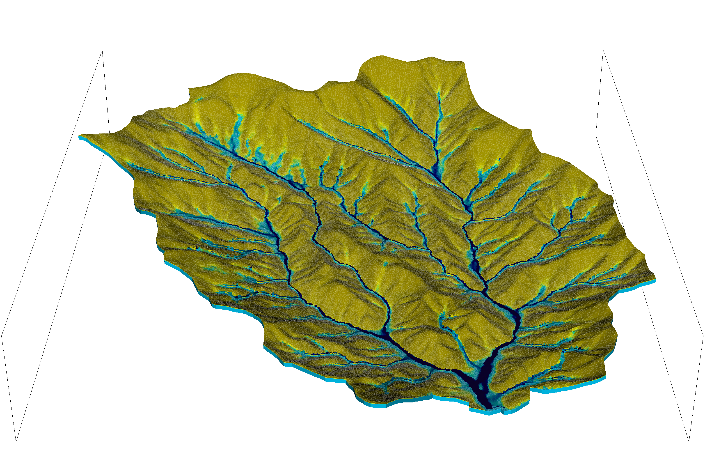

# ATS MDA Reporting Format instructions

Prepare a curated archive of completed Advanced Terrestrial Simulator (ATS) simulations for ESS-DIVE using the [workflow notebook](ats_mda_workflow.ipynb). Follow the steps below, then review the required package contents before publication. The [background and reference page](BACKGROUND.md) contains the ATS input/output review, symbol table, and general Model Data Archiving Guidelines.

For the presentation accompanying this workflow, see Li, Zhi (2026, May 13). [ATS MODEL DATA ARCHIVE (MDA) FORMAT](https://zenodo.org/records/23049310) [Presentation slides]. Zenodo. DOI: [10.5281/zenodo.23049310](https://doi.org/10.5281/zenodo.23049310).

## Steps at a glance

1. **Configure** source and staging paths, file selection, and observation schema (step 0).
2. **Validate and copy** the selected simulation files (steps 1–2).
3. **Curate** intermediate files while retaining required production outputs (step 3).
4. **Generate File Level Metadata and Data Dictionary files**, then review completeness (steps 4–7).
5. **Finish metadata and optionally package** large directories, then generate final checksums (steps 7–9).
6. **Submit** the reviewed archive and metadata to ESS-DIVE.

[Detailed workflow](#ats-mda-workflow-a-step-by-step-guide) · [Package requirements](#ats-mda-reporting-format-v100) · [FAQ](#faq)

<table width="100%">
  <tr>
    <td width="33.33%" align="center" valign="middle"></td>
    <td width="33.33%" align="center" valign="middle"></td>
    <td width="33.33%" align="center" valign="middle"></td>
  </tr>
</table>

[Figure sources and acknowledgments](BACKGROUND.md#figure-sources-and-acknowledgments)

## ATS MDA Workflow: A Step-by-Step Guide

Use the [notebook](ats_mda_workflow.ipynb) together with [ats_mda_utils.py](ats_mda_utils.py) from this repository. Python 3.10+, Jupyter, and `pandas` are required. Run setup, edit Configuration, and execute the numbered steps in order, reviewing each result. The notebook creates a local package; it does not upload or publish data.

### Step 0 — Configure paths and options

Set `simulation_dir` to completed, stable ATS output and `data_pkg_dir` to a separate staging directory. Neither directory may contain the other. Review `include_extensions` and `include_name_globs` against the package requirements below. Source symbolic links are skipped and reported; supply real copies of needed linked files.

Start with `cleanup_mode="preview"`, `write_new_csv=False`, and `create_archives=False`. Set the observation prefix/extension and `dd_file_name`. The notebook explains all options beside the editable configuration block.

Each step logs its start, completion or failure, and elapsed time. Large operations report bytes, percentage, and throughput at intervals controlled by `progress_seconds` (default 5). `log_level="DEBUG"` adds individual file and header details. A session log is appended beside staging, outside the publication payload; console logging continues if file logging is unavailable.

### Step 1 — Validate source and staging

The notebook validates paths and options, creates staging if needed, and reports existing files and free space. Symbolic links and multiply linked files in staging are rejected so file operations use independent copies. Fix any reported path or storage issue before continuing.

### Step 2 — Copy selected files

A portable Python streaming copy preserves relative paths and reports progress within large files. Reruns compare existing content with SHA256 and reuse identical files. Differing files stop the copy before new data are written unless `overwrite_existing=True`; review those differences or choose fresh staging.

Individual files are written to temporary paths and replaced only when complete. Completed files remain after an interruption and can be reused on retry. Copying again can restore files removed during cleanup, so repeat cleanup if needed.

### Step 3 — Preview and apply cleanup

With `cleanup_mode="preview"`, the notebook displays proposed removals without deleting files. Review the table, change the setting to `"apply"`, rerun Configuration and this step to apply it. Use `"skip"` to retain everything.

Checkpoint folders are identified by `run_tokens`. Non-final checkpoints are candidates only when the same folder contains a checkpoint matching `keep_checkpoint_token`. Unrecognized final-checkpoint naming or missing run directories produce warnings and preserve the files.

Visualization HDF5 and XMF files are retained by default. To remove them for spinup/ensemble runs, explicitly list relative directories in `visualization_run_dirs`. Retain visualization outputs for non-ensemble production/transient runs as required below.

### Step 4 — Generate File Level Metadata

The inventory uses the [FLMD v1.2.0 template](https://github.com/ess-dive-workspace/essdive-file-level-metadata/blob/release-v1.2.0/file_level_metadata_flmd/template_flmd.csv). `file_name` contains the package-relative path. Existing descriptions, notes, and dictionary associations are reloaded from `flmd.csv` and retained. Missing files are removed from the inventory with a warning; new files receive draft entries. Legacy schemas must be backed up and migrated before rerunning.

Review every `file_description` and `standard`. Applicable model files default to `ESS-DIVE ATS MDA v1`; companion metadata tables use `ESS-DIVE FLMD v1`. Unknown optional values remain blank. Step 5 supplies dictionary associations and header positions. The final checksum manifest is excluded from the inventory.

### Step 5 — Generate one Data Dictionary for an observation schema

Each execution creates one dictionary, named by `dd_file_name` (`dd.csv` by default). All matching files must have identical header names and units; each file's header position is checked separately before any optional rewrite. Differing schemas stop the step. No matches produce a warning and no dictionary.

The [DD v1.2.0 fields](https://github.com/ess-dive-workspace/essdive-file-level-metadata/blob/release-v1.2.0/data_dictionary_dd/template_dd.csv) are `column_or_row_name`, `unit`, `definition`, `column_or_row_long_name`, `data_type`, and `missing_value_code`. Names match actual data headers exactly. Provide one actual missing-value code per variable. Existing dictionaries with the same names and units retain manual entries; incompatible schemas require a different dictionary filename.

For additional schemas, select a different `obs_file_handle` and a distinct name such as `energy_balance_dd.csv`, then repeat steps 5–7. FLMD associations persist on disk, including after a kernel restart. See the FAQ below for parser requirements and optional header rewriting.

### Step 6 — Suggest missing definitions

If `download_definitions=True`, the notebook retrieves the ATS symbol table with a timeout and bounded attempts. It suggests definitions only for blank entries, preserving manual edits. Download or parsing failures leave the dictionary intact for manual completion. Review every suggestion for scientific meaning and fill remaining blanks.

### Step 7 — Review files and complete dataset metadata

Review the notebook's table of missing/short descriptions, missing files, missing dictionary associations, and blank definitions/units. Save edits to `flmd.csv` and the dictionaries, then rerun the review. Automated checks do not certify scientific accuracy or ESS-DIVE compliance.

#### Dataset start and end dates

For a model dataset, report the calendar period represented by the archived data. For example, an archived simulation covering 2001-10-01 through 2010-09-30 should use those dates even if the computer job ran in 2026. Do not substitute job execution, file creation, or upload dates for the modeled period.

- Use `YYYY` or `YYYY-MM-DD`, following [ESS-DIVE's dataset date requirements](https://docs.ess-dive.lbl.gov/contributing-data/package-level-metadata#dates).
- For multiple runs with calendar dates, use the earliest represented start and latest represented end across the included data. Explain differing forcing, evaluation, spinup, and production periods in the Methods and package README; document file-specific coverage in `file_description` or `notes`.
- Record the model time origin, elapsed-time units, calendar, and any repeated forcing cycles. Artificial spinup years or elapsed simulation time must not be presented as real calendar dates without a documented mapping.
- For idealized, steady-state, or other simulations with no meaningful calendar dates, explain this in the Methods and consult ESS-DIVE support about the required Start Date before publication. Do not invent a date. Leave End Date blank only where appropriate, such as an open-ended dataset.

The notebook does not infer dataset dates. These belong in dataset metadata; `start_date` and `end_date` are not fields in the v1.2.0 FLMD template.

#### Reporting format keyword and standard

- Add **`ESS-DIVE ATS Model Data Archive (MDA) Reporting Format`** to the dataset metadata **Keywords** field.
- In `flmd.csv`, set **`standard`** to **`ESS-DIVE ATS MDA v1`** for files described by this reporting format. Use the major version only. The keyword is a dataset-level label; `standard` is a per-file field.
- The generated metadata tables use **`ESS-DIVE FLMD v1`** as their standard. Also include **`ESS-DIVE File Level Metadata Reporting Format`** in the dataset keywords when submitting them. Use one applicable standard per file and review the notebook's assignments.
- Set `data_dictionary_file_name` for every tabular file with an associated dictionary. Use `dd.csv` or a filename ending in `_dd.csv`; do not use wildcards in this field.

### Step 8 — Optionally create archives for transfer

Set `create_archives=True` after metadata review. One `.tar.gz` is created per immediate, non-hidden subdirectory. Root files, including metadata tables, are copied alongside the archives. The output is a separate sibling `<package>_archives` folder unless `archive_output_dir` is set; it must be empty and separate from source/staging. Hidden subdirectories are not archived; move publishable data out of them first.

Python creates archives and split parts without requiring `tar` or `split` executables. Archives above `split_size_gib` (default 5 GiB) are divided into numbered parts, whose combined SHA256 is verified. Original tarballs and the staging tree are retained. Allow space for both intact archives and parts.

`package-manifest.json` records completion and file state so step 9 can reject incomplete or stale packaging. If packaging fails or staged files change, rebuild into a fresh output folder. Do not reuse old archives without checking their content.

### Step 9 — Generate final checksums, then submit

With `create_checksums=True`, the notebook writes `sha256sums.txt` in staging and, when packaging is enabled, a separate manifest in the archive output directory. Checksums are generated **after metadata edits and packaging**. Each manifest excludes itself and covers files in its own directory. Interrupted/failed writes retain the previous complete manifest.

Verify from the relevant directory on Linux/HPC with `sha256sum -c sha256sums.txt`. If transferring only split parts, reconstruct omitted tarballs before checking the full archive-directory manifest, or provide a manifest covering exactly the transferred files. Use the staging manifest to verify extracted original files. Regenerate affected archives and manifests after any later edits.

Submit the reviewed data and metadata following the [ESS-DIVE documentation](https://docs.ess-dive.lbl.gov/). Contact ESS-DIVE support for large transfers. The notebook provides a final submission checklist and reconstruction commands.

## ATS MDA Reporting Format v1.0.0

Driven by community feedback collected through a user survey, best practices established by experienced model users, and recommendations provided by model developers, we have developed the ESS-DIVE ATS MDA Reporting Format. This Reporting Format is designed to improve the consistency, transparency, and accessibility of data produced by ATS modeling activities, enabling better data sharing, traceability, and long-term usability across the hydrologic modeling community and beyond.

### To Include

* ESS-DIVE metadata files
* ATS mesh file
* ATS config file
* **Processed** ATS input files
* ATS final checkpoint files
* ATS observation files
* ATS visualization files for non-spinup & ensemble runs
* ATS metadata files accompanying visualization files for non-spinup & ensemble runs
* ATS version and Watershed Workflow version
* ATS job submission scripts and slurm output files (if HPC)
* Manuscript-associated files, including figures and plotting scripts

### Not To Include

* ATS source code
* Watershed Workflow source code
* **Raw** model input files
* **Raw** model evaluation files
* **Raw** data used for any other purposes
* ATS periodic checkpoint files
* ATS visualization files for spinup & ensemble runs
* ATS metadata files accompanying visualization files for spinup & ensemble runs

> **Info:** Processed input files must be ATS-readable, e.g., `mywatershed_MODIS_LAI.h5`; raw input files cannot be directly read in ATS, e.g., `MOD10A2.061_500m_aid0001.nc`.


### Specific

#### Metadata files

| File Type                                 | Include? |
| ----------------------------------------- | -------- |
| ESS-DIVE Data dictionary file (`dd.csv`)           | YES      |
| ESS-DIVE File Level Metadata file (`flmd.csv`)     | YES      |
| Readme file (e.g., `.txt/.docx/.pdf/.md`) | YES      |

#### Manuscript-associated files

| File Type                                                                  | Include?    |
| -------------------------------------------------------------------------- | ----------- |
| Figures (e.g., `.png`/`.jpg`/`.pdf`/`.eps`)                                | YES         |
| Plotting scripts (e.g., `.py`/`.ipynb`/`.r`/`.m`)                          | YES         |
| Data behind the plots (e.g., `.csv`/`.dat`/`.h5`)                          | YES         |
| Open data list (in Appendix/Supplementary Material/Supporting Information) | RECOMMENDED |

#### Model input files and model evaluation data files

| File Type                              | Include? |
| -------------------------------------- | -------- |
| ATS model config file (`.xml`)         | YES      |
| ATS mesh file (`.exo`)                 | YES      |
| Watershed Workflow notebook (`.ipynb`) | YES      |
| Meteorological forcing data (`.h5`)    | YES      |
| Leaf Area Index data (`.h5`)           | YES      |
| Other user-defined input data (`.h5`)  | YES      |
| ATS version                            | YES      |
| Watershed Workflow version             | YES      |
| ATS source code                        | NO       |
| WW source code                         | NO       |
| Raw USGS/EPA/etc. data (`.csv/.dat`)   | NO       |
| Raw MODIS data (`.nc`)                 | NO       |
| Raw other data                         | NO       |

#### Model output files (spinup runs and ensemble runs)

| File Type                                                                | Include     |
| ------------------------------------------------------------------------ | ------------ |
| ATS metadata files accompanying visualization files (`.xmf`)             | NO           |
| ATS visualization files (`.h5`)                                          | NO           |
| ATS periodic checkpoint files (`.h5`)                                    | NO           |
| ATS final checkpoint files (`.h5`)                                       | YES          |
| ATS observation files (`.csv`/`.dat`)                                    | YES          |
| ATS job submission scripts (`.sh`) and slurm output files (`slurm*.out`) | YES (if HPC) |

#### Model output files (transient runs/'production' runs)

| File Type                                                                       | Include     |
| ------------------------------------------------------------------------------- | ------------ |
| ATS metadata files accompanying visualization files (`.xmf`) (grouped & zipped) | YES          |
| ATS visualization files (`.h5`)                                                 | YES          |
| ATS periodic checkpoint files (`.h5`)                                           | NO           |
| ATS final checkpoint files (`.h5`)                                              | YES          |
| ATS observation files (`.csv`/`.dat`)                                           | YES          |
| ATS job submission scripts (`.sh`) and slurm output files (`slurm*.out`)        | YES (if HPC) |

## FAQ

### Does the notebook modify my original simulation directory?

No. It reads the source and writes to separate staging/archive directories. Nested paths are rejected, staging links are rejected, and each replacement is completed through a temporary file. Stop simulations and other writers before preparing the archive.

### What should I do after an interruption or kernel restart?

Rerun setup and Configuration after a kernel restart, then retry the affected step. Metadata is reloaded from disk. Completed copies can be reused after content comparison. Do not rerun copying unless needed, because it can restore cleaned-up files. If packaging was interrupted, use a fresh archive output folder. Temporary `.ats-mda-*` leftovers from a killed kernel are skipped and logged; remove them only after confirming no process is using them.

### I do not have run0, run1, or run2. Will cleanup fail?

No. Missing matches are logged and checkpoint cleanup is skipped. Change `run_tokens` to match your directories. If final checkpoints use another naming convention, set `keep_checkpoint_token`; folders with no recognizable final checkpoint retain all checkpoints.

### How do I preserve production visualization files?

They are preserved by default. Keep non-ensemble production directories out of `visualization_run_dirs`. Preview any selected spinup/ensemble removals before changing `cleanup_mode` to `"apply"`.

### How do I see more progress detail?

Set `log_level="DEBUG"` for individual file and header information, or reduce `progress_seconds` for more frequent progress updates. Rerun Configuration. INFO logs show major operations, byte/count progress, elapsed time, warnings, and summaries. Compression percentages track input bytes read rather than predicted final compressed size.

### What format must observation files use?

Use UTF-8 comma-delimited text with one uncommented header row. Quoted CSV fields and preambles are supported. Header detection looks for bracketed units; use `header_line_hint` for other headers. This is a 0-based physical line index including comment lines, while FLMD positions are 1-based and exclude comment lines. Multi-line headers, separate unit rows, whitespace delimiters, and other encodings need preparation first.

The `.dat` or `.txt` extension is supported only if contents follow this CSV structure. Follow the [ESS-DIVE CSV File Structure Reporting Format](https://github.com/ess-dive-workspace/essdive-csv-structure) for tabular files intended for parsing. Native XML, Exodus, and HDF5 files retain their native formats.

### Does the notebook make one dictionary or several?

It makes one per execution of step 5. Use one dictionary for files sharing header meanings and units, or a distinct `*_dd.csv` for each different schema. Repeat steps 5–7 with appropriate prefixes and names. The notebook updates `data_dictionary_file_name` in FLMD and preserves previous associations on disk. Identical labels with different meanings must be reviewed manually and documented in separate dictionaries.

### Can I normalize CSV header names?

Yes. `write_new_csv=True` creates `_cleaned.csv` files; `inplace=True` instead rewrites staged headers. Data values are streamed unchanged. The dictionary describes the resulting headers. Keep separate dictionaries for retained original headers or remove unwanted originals before publication. Existing cleaned outputs require explicit review before replacement. This feature does not perform general CSV-format conversion.

### What happens if definition lookup fails?

The notebook logs the bounded attempts and continues with your saved dictionary. Fill blanks manually or retry step 6 later. Existing definitions are preserved. Set `download_definitions=False` to avoid network access.

### Do I need rsync, tar, or split installed?

No. Copying, archiving, splitting, and hashing use Python. The reconstruction examples use standard Linux/HPC commands for recipients.

### Why must the archive folder be empty?

This prevents stale archives or partial split sets from being mistaken for current output. Choose a fresh output folder after a failure or after changing staging. The completion manifest also prevents step 9 from checksumming a known incomplete or stale package as if packaging had finished.

### How do I reconstruct a split archive?

Place all parts in one directory and confirm their count against the source. On Linux/HPC:

```bash
cat run0.tar.gz.part* > run0.tar.gz
gzip -t run0.tar.gz
tar -xzf run0.tar.gz
```

Extract into a fresh directory, restore root metadata beside the run folders, and verify original files using the staging checksum manifest. The transfer folder retains intact tarballs and parts; generally upload either the tarball or its complete set of parts.

## Help Center

- Check the [FAQ](#faq) for workflow questions.
- Ask the [ATS User Google Group](https://groups.google.com/g/ats-users) for ATS-related help.
- [Contact ESS-DIVE](https://ess-dive.lbl.gov/contact/) for repository and publication questions.
