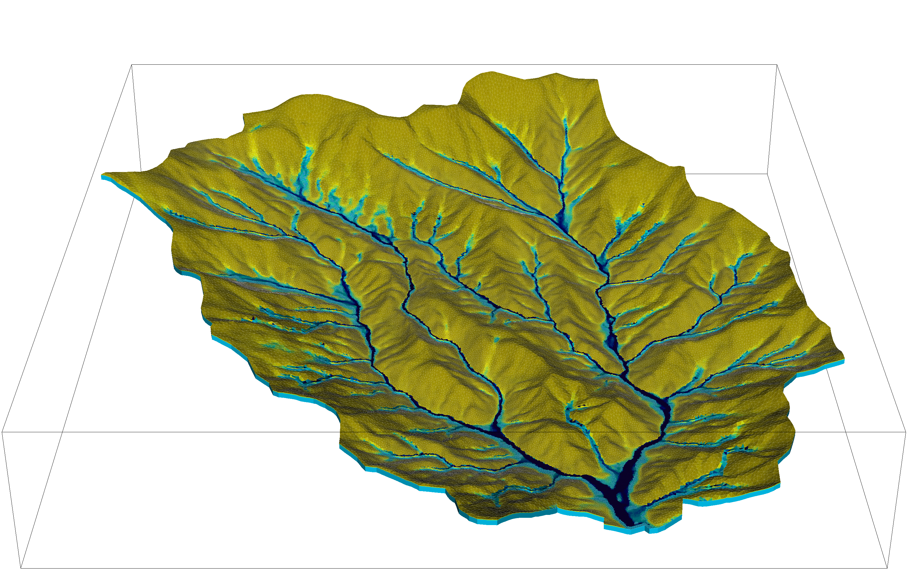

<h2 align="center">Welcome to ATS Model Data Archiving (MDA) Documentation</h2>

<table data-view="cards">
  <thead><tr><th></th><th data-type="content-ref"></th><th data-hidden data-card-cover data-type="image">Cover image</th></tr></thead>
  <tbody>
    <tr>
      <td><strong><code>Advanced Terrestrial Simulator (ATS)</code></strong> is an open-source, multiphysics numerical modeling code used for solving complex ecohydrology and earth system problems. It's a powerful tool for simulating integrated, distributed hydrology at watershed-to-river basin scales.</td>
      <td><a href="https://amanzi.github.io/ats/stable/">https://amanzi.github.io/ats/stable/</a></td>
      <td><a href="product.html"></a></td>
    </tr>
    <tr>
      <td>Funded by the U.S. Department of Energy’s Office of Science Biological and Environmental Research (BER) program under its Environmental System Science (ESS) program, <strong><code>ESS-DIVE</code></strong> (Environmental System Science Data Infrastructure for a Virtual Ecosystem) is a data repository for earth and environmental science data. </td>
      <td><a href="https://ess-dive.lbl.gov/">https://ess-dive.lbl.gov/</a></td>
      <td><a href="product.html"></a></td>
    </tr>
    <tr>
      <td><strong>Model Data Archiving (MDA)</strong> is a data standard and a set of instructions developed to guide the archival and sharing of data generated from environmental model simulations.</td>
      <td><a href="https://github.com/ess-dive-workspace/essdive-ATS-model-data-archiving/">https://github.com/ess-dive-workspace/essdive-ATS-model-data-archiving/</a></td>
      <td><a href="product.html"></a></td>
    </tr>
  </tbody>
</table>


# ATS MDA Documentation

This document aims to outline the motivation, review the fundamentals of ATS inputs and outputs, examine the existing MDA Reporting Format, and provide a detailed guide on creating and managing ATS MDAs using the improved standards.


## Background

Managing and archiving the diverse data types used and generated by watershed- or basin-scale hydrologic models pose significant challenges due to the models’ complexity, spatiotemporal heterogeneity, and the large size of the associated datasets.

The utilization of iterative model-experiment ([ModEx](https://ess.science.energy.gov/modex/)) approach across all [ESS ](https://ess.science.energy.gov/)research necessitates model data that serves different roles for different users of that data.

Previous [ESS-DIVE](https://ess-dive.lbl.gov/) efforts to understand the needs and commonalities of MDAs took a big-picture look at ESS modeling activities and included surveying the ESS modeling community and developing a best-practices approach for MDAs. In this work, we built from the ground up, focusing instead on a single, specific codebase that is widely used across the ESS community and working to prototype and implement the vision set forth by [Simmonds et al. (2022)](https://doi.org/10.5334/dsj-2022-003).

_There is a growing need for enhanced model data discovery, readability, and traceability._

Our scope is to engage with the modeling community, establish and prototype improved standards for managing and archiving model data, and develop tutorial materials to offer long-term support to the community.

This work also paves the way for other ESS codebases to develop similar standards.


## Review: ATS IO

ATS IO includes three output file types:

1. **visualization files (`.h5`)**,
2. **observation files (`.csv`, `.dat`, `.txt`, ...)**, and
3. **checkpoint files (`.h5`)**.

Visualization is _dense in space but sparse in time_. It saves every grid cell’s values, but realistically can only be done at a subset of timesteps. Example `xml` block:

```xml
<ParameterList name="visualization">
  <Parameter name="file name base" type="string" value="visdump_data"/>
  <Parameter name="cycles start period stop" type="Array(int)" value="{0, 100, -1}" />
  <Parameter name="cycles" type="Array(int)" value="{999, 1001}" />
  <Parameter name="times start period stop 0" type="Array(double)" value="{0.0, 10.0, 100.0}"/>
  <Parameter name="times start period stop 1" type="Array(double)" value="{100.0, 25.0, -1.0}"/>
  <Parameter name="times" type="Array(double)" value="{101.0, 303.0, 422.0}"/>
  <Parameter name="dynamic mesh" type="bool" value="false"/>
</ParameterList>
```

Observations are _sparse in space but dense in time_. They typically integrate or average a quantity across (a subset of) cells, but can be saved much more frequently (even every timestep). Therefore, they are complementary, and care should be taken to use the right one to address a given goal. Example `xml` block:

```xml
  <ParameterList name="observations" type="ParameterList">
    <ParameterList name="water_balance_computational_domain" type="ParameterList">
      <Parameter name="observation output filename" type="string" value="water_balance_computational_domain.csv" />
      <Parameter name="delimiter" type="string" value="," />
      <Parameter name="time units" type="string" value="d" />
      <Parameter name="times start period stop" type="Array(double)" value="{ 0, 1,-1}" />
      <Parameter name="times start period stop units" type="string" value="d" />
      <ParameterList name="observed quantities" type="ParameterList">
        <ParameterList name="net runoff [mol d^-1]" type="ParameterList">
          <Parameter name="variable" type="string" value="surface-water_flux" />
          <Parameter name="region" type="string" value="external_sides" />
          <Parameter name="location name" type="string" value="face" />
          <Parameter name="functional" type="string" value="extensive integral" />
          <Parameter name="direction normalized flux" type="bool" value="true" />
          <Parameter name="time integrated" type="bool" value="true" />
        </ParameterList>
        <ParameterList name="river discharge [mol d^-1]" type="ParameterList">
          <Parameter name="variable" type="string" value="surface-water_flux" />
          <Parameter name="region" type="string" value="surface domain outlet" />
          <Parameter name="location name" type="string" value="face" />
          <Parameter name="functional" type="string" value="extensive integral" />
          <Parameter name="direction normalized flux" type="bool" value="true" />
          <Parameter name="time integrated" type="bool" value="true" />
        </ParameterList>
        <ParameterList name="net groundwater flux [mol d^-1]" type="ParameterList">
          <Parameter name="variable" type="string" value="water_flux" />
          <Parameter name="region" type="string" value="external_sides" />
          <Parameter name="location name" type="string" value="face" />
          <Parameter name="functional" type="string" value="extensive integral" />
          <Parameter name="direction normalized flux" type="bool" value="true" />
          <Parameter name="time integrated" type="bool" value="true" />
        </ParameterList>
      </ParameterList>
    </ParameterList>
```

Checkpoint files are mostly an internal format that supports checkpoint/restart capabilities to allow runs to be continued and is used in regression testing. Example `xml` block:

```xml
<ParameterList name="checkpoint">
  <Parameter name="cycles start period stop" type="Array(int)" value="{0, 100, -1}" />
  <Parameter name="cycles" type="Array(int)" value="{999, 1001}" />
  <Parameter name="times start period stop 0" type="Array(double)" value="{0.0, 10.0, 100.0}"/>
  <Parameter name="times start period stop 1" type="Array(double)" value="{100.0, 25.0, -1.0}"/>
  <Parameter name="times" type="Array(double)" value="{101.0, 303.0, 422.0}"/>
</ParameterList>
```


## Review: ATS Default Names, Symbols, and Units

Source:



| Variable Root Name                        | Symbol                | Description                                                                      | Units                                                              | Process   |
| ----------------------------------------- | --------------------- | -------------------------------------------------------------------------------- | ------------------------------------------------------------------ | --------- |
| coordinate, centroid                      | $x$, $y$, $z$         | spatial coordinates                                                              | $\[m]$                                                             |           |
| time                                      | $t$                   | time variable                                                                    | $\[s]$                                                             |           |
| cell\_volume                              | $\vert V \vert$, $V$  | volume (if 3D) or area (if 2D) of a discrete element                             | $\[m^3]$ or $\[m^2]$                                               |           |
| gravity                                   | $g$                   | gravitational acceleration vector                                                | $\[m , s^{-2}]$                                                    |           |
| canopy-drainage                           | $D$                   | flux of water dripping from the canopy to the ground below                       | $\[m , s^{-1}]$                                                    | canopy    |
| canopy-throughfall\_drainage\_{rain,snow} |                       | source of {rain,snow} to the respective layer, throughfall + drainage            | $\[m , s^{-1}]$                                                    | canopy    |
| canopy-evaporation                        | $E\_{can}$            | evaporative flux of stored water from the leaf surface                           | $\[m , s^{-1}]$                                                    | canopy    |
| canopy-fracwet                            | $f\_{wet}$            | fraction of the canopy leaf area that is covered in water                        | $\[-]$                                                             | canopy    |
| canopy-water\_content                     | $\Theta\_{can}$       | $^5$ extensive water content on the leaf surface                                 | $\[\mathop{\mathrm{mol\}}] ^8$                                     | canopy    |
| canopy-water\_equivalent                  |                       | effective thickness of water (per unit surface or leaf area?)                  | $\[m]$                                                             | canopy    |
| canopy-water\_source                      |                       | sum of all sources and sinks of water to the leaf surface                        | $\[\mathop{\mathrm{mol\}} , m^2 , s^{-1}]$                         | canopy    |
| canopy-water\_source\_meters              |                       | sum of all sources and sinks of water to the leaf surface                        | $\[m , s^{-1}]$                                                    | canopy    |
| canopy-interception                       | $I\_{can}$            | flux of water to the canopy as intercepted rain or snow                          | $\[m , s^{-1}]$                                                    | canopy    |
| canopy-leaf\_area\_index                  | $LAI$                 | leaf area per unit surface area                                                  | $\[-]$                                                             | canopy    |
| canopy-potential\_transpiration           | $T\_{pot}$            | potential transpiration, unlimited by water availability                         | $\[m , s^{-1}]$                                                    | canopy    |
| canopy-potential\_transpiration\_mols     | $T\_{pot}$            | potential transpiration, unlimited by water availability                         | $\[\mathop{\mathrm{mol\}} , m^{-2} , s^{-1}]$                      | canopy    |
| canopy-temperature                        | $T\_{can}$            | leaf temperature, used in longwave radiation out calculation                     | $\[K]$                                                             | canopy    |
| {canopy,snow,surface}-radiation\_balance  |                       | net energy balance including radiation and conduction (Priestley-Taylor's R - G) |                                                                    | surface   |
| snow-depth                                | $h\_{snow}$           | thickness of the snowpack                                                        | $\[m]$                                                             | snow      |
| snow-age                                  |                       | average age of the snowpack                                                      | $\[day]$                                                           | snow      |
| snow-density                              | $\rho\_{snow}$        | Mass density of the snow                                                         | $\[kg , m^-3]$                                                     | snow      |
| snow-melt                                 | $M$                   | Snow melt rate (SWE)                                                             | $\[m \mathop{\mathrm{SWE\}} s^{-1}]$                               | snow      |
| snow-precipitation                        | $P\_{snow}$           | precipitation of snow, in snow-water-equivalent (SWE)                            | $\[m \mathop{\mathrm{SWE\}} , s^{-1}]$                             | snow      |
| snow-evaporation                          | $E\_{snow}$           | evaporation of snow, in snow-water-equivalent (SWE)                              | $\[m \mathop{\mathrm{SWE\}} , s^{-1}]$                             | snow      |
| snow-source\_sink                         | $Q\_{snow}$           | extensive sum of all sources and sinks of water as snow                          | $\[\mathop{\mathrm{mol\}} , s^{-1}]$                             | snow      |
| snow-water\_source                        | $Q\_{snow}$           | sum of all sources and sinks of water as snow                                    | $\[\mathop{\mathrm{mol\}} , m^{-2} s^{-1}]$                      | snow      |
| snow-water\_source\_meters                | $Q\_{snow}$           | sum of all sources and sinks of water as snow                                    | $\[m , s^{-1}]$                                                  | snow      |
| snow-source                               |                       | sum of all sources of water as snow, excluding sinks                             | $\[m , s^{-1}]$                                                    | snow      |
| snow-death\_rate                          |                       | If all snow disappears in a timestep, the effective rate of snow loss.           | $\[m \mathop{\mathrm{SWE\}} s^{-1}]$                               | snow      |
| snow-water\_equivalent                    | $SWE$                 | equivalent "ponded\_depth" if one melted the snow                                | $\[m]$                                                             | snow      |
| snow-water\_content                       | $\Theta\_{snow}$      | $^5$ extensive water content in snow                                             | $\[\mathop{\mathrm{mol\}}] ^8$                                     | snow      |
| snow-temperature                          | $T\_{snow}$           | temperature of the snowpack                                                      | $\[K]$                                                             | snow      |
| surface-ponded\_depth                     | $h$                   | ponded depth, or the water head over the surface                                 | $\[m]$                                                             | flow      |
| surface-unfrozen\_effective\_depth        | $\eta h$              | portion of ponded depth that is unfrozen                                         | $\[m]$                                                             | flow      |
| surface-unfrozen\_fraction                | $\eta$                | fraction of water on the surface that is liquid (vs ice)                         | $\[-]$                                                             | energy    |
| surface-albedo                            | $\alpha$              | area-weighted albedo of the surface, as seen by the canopy/atmosphere            | $\[-]$                                                             | surface   |
| surface-albedos.{bare,water,snow}         | $\alpha$              | albedo of a given media                                                          | $\[-]$                                                             | surface   |
| surface-emissivities.{bare,water,snow}    | $\epsilon$            | emissivity (equivalently absorptivity) of a given media                          | $\[-]$                                                             | surface   |
| surface-area\_fractions.{bare,water,snow} | $a$                   | fraction of the ground surface of a given media                                  | $\[-]$                                                             | surface   |
| surface-incoming\_longwave\_radiation     | $Q^e\_{SW}$           | longwave radiation from the atmosphere                                           | $\[W , m^{-2}]$                                                    | surface   |
| surface-incoming\_shortwave\_radiation    | $Q^e\_{SW}$           | shortwave radiation from the atmosphere                                          | $\[W , m^{-2}]$                                                    | surface   |
| surface-incident\_shortwave\_radiation    | $Q^e\_{SWin}$         | shortwave radiation incident on a surface (of a given slope/aspect)              | $\[W , m^{-2}]$                                                    | surface   |
| surface-qE\_conducted                     | $Q^e\_{c}$            | energy conducted to the ground surface                                           | $\[W , m^{-2}]$                                                    | surface   |
| surface-qE\_lw\_out                       | $Q^e\_{LWout}$        | longwave energy radiated away from the surface                                   | $\[W , m^{-2}]$                                                    | surface   |
| surface-qE\_sensible\_heat                | $Q^e\_{h}$            | sensible heat flux to the atmosphere                                             | $\[W , m^{-2}]$                                                    | surface   |
| surface-qE\_latent\_heat                  | $Q^e\_{E}$            | latent heat flux to the atmosphere                                               | $\[W , m^{-2}]$                                                    | surface   |
| surface-qE\_snowmelt                      | $Q^e\_{snow}$         | latent heat released via snowmelt                                                | $\[W , m^{-2}]$                                                    | surface   |
| surface-transpiration                     | $T$                   | actual transpiration, integrated vertically and limited by water availability    | $\[m , s^{-1}]$                                                    | flow      |
| surface-total\_evapotranspiration         | $ET$                  | total evaporation (canopy, snow, and bare ground) plus transpiration             | $\[m , s^{-1}]$                                                    | flow      |
| surface-capillary\_pressure\_plant        | $pc\_{can}$           | capillary pressure in the plant stem at the ground surface                       | $\[Pa]$                                                            | flow      |
| surface-overland\_conductivity            | $k$                   | coefficient for the diffusion wave equation                                      | $\[...]$                                                           | flow      |
| surface-manning\_coefficient              | $m\_n$                | coefficient in Manning's equation, a measure of surface roughness                | $\[...]$                                                           | flow      |
| surface-precipitation\_rain               | $P\_{r}$              | precipitation of rain                                                            | $\[m , s^{-1}]$                                                    | surface   |
| surface-air\_temperature                  | $T\_{air}$            | temperature of the air at the ground surface                                     | $\[K]$                                                             | surface   |
| surface-vapor\_pressure\_air              | $vp\_{air}$           | partial pressure of water vapor in the atmosphere                                | $\[Pa]$                                                            | surface   |
| surface-wind\_speed                       | ${v}\_{air}$          | magnitude of the wind speed                                                      | $\[m , s^{-1}]$                                                    | surface   |
| surface-water\_source                     | $Q\_s$                | extensive sum of all sources and sinks of water as liquid (surface)              | $\[\mathop{\mathrm{mol\}} , s^{-1}]$                               | flow      |
| surface-elevation                         | $z$                   | elevation                                                                        | $\[m]$                                                             |           |
| surface-aspect                            | $\psi$                | aspect, clockwise relative to North, in \[0,360)                                 | $\[degrees]$                                                       | surface   |
| surface-slope\_magnitude                  | $\vert S \vert$       | 1 - dot product of the surface's normal with the vertical                        | $\[-]$                                                             | flow      |
| surface-water\_flux                       | $\mathbf{q\_s}$       | surface flux vector                                                              | $\[\mathop{\mathrm{mol\}} , s^{-1}]$                               | flow      |
| surface-velocity.{1,2} $^4$               | $\mathbf{V\_s}$       | surface water velocity vector                                                    | $\[m , s^{-1}]$                                                    | flow      |
| surface-evaporative\_flux                 | $E$                   | water sink due to evaporation                                                    | $\[m , s^{-1}]$                                                    | flow      |
| surface-evaporation                       | $E$                   | water sink due to evaporation                                                    | $\[m , s^{-1}]$                                                    | flow      |
| surface-soil\_resistance                  | $r\_{soil}$           | resistance of soil to water vapor transport, used in evaporation downregulation  | $\[-]$                                                             | flow      |
| surface-subsurface\_flux                  | $\mathbf{q\_{ss\}}$   | infiltration, the flux of water into the ground                                  | $\[\mathop{\mathrm{mol\}} , s^{-1}]$                               | flow      |
| surface-subsurface\_energy\_flux          | $\mathbf{q^e\_{ss\}}$ | diffusive flux of energy into the ground                                         | $\[\mathop{\mathrm{MJ\}} , s^{-1}]$                                | energy    |
| surface-advected\_energy\_flux            | $\mathbf{eq\_s}$      | extensive energy flux due to advection (face-based)                              | $\[\mathop{\mathrm{MJ\}} , s^{-1}]$                                | energy    |
| surface-diffusive\_energy\_flux           | $\mathbf{q\_s^e}$     | extensive energy flux due to diffusion (face-based)                              | $\[\mathop{\mathrm{MJ\}} , s^{-1}]$                                | energy    |
| surface-water\_content                    | $\Theta\_s$           | $^5$ extensive water content (liquid or ice, but not snow) of a cell             | $\[\mathop{\mathrm{mol\}}]$                                        | flow      |
| surface-temperature                       | $T\_s$                | temperature of ponded water or the ground surface                                | $\[K]$                                                             | energy    |
| surface-source\_molar\_density            | $n\_{source}$         | molar density of all water sources (surface)                                     | $\[\mathop{\mathrm{mol\}} , m^{-3}]$                               | flow      |
| transpiration                             | $T$                   | actual transpiration, vertically distributed to the subsurface                   | $\[\mathop{\mathrm{mol\}} , m^-3 , s^{-1}]$                        | flow      |
| root\_fraction                            | $f\_r$                | fraction of all roots in this soil layer (vertically sums to 1)                  | $\[-]$                                                             | flow      |
| permeability                              | $K$                   | absolute permeability                                                            | $\[m^2]$                                                           | flow      |
| relative\_permeability $^1$               | $k\_r$                | relative **conductivity**, $\frac{n}{\mu} k$                                     | see note                                                           | flow      |
| molar\_density\_{liquid,gas,ice} $^7$     | $n\_\{{l,g,i\}}$      | molar density of a given phase                                                   | $\[\mathop{\mathrm{mol\}} , m^{-3}]$                               |           |
| mass\_density\_{liquid,gas,ice}           | $\rho\_\{{l,g,i\}}$   | mass density of a phase                                                          | $\[\mathop{\mathrm{kg\}} , m^{-3}]$                                |           |
| density\_rock                             | $\rho\_{rock}$        | mass density of the medium                                                       | $\[\mathop{\mathrm{kg\}} , m^{-3}]$                                |           |
| pressure                                  | $p$                   | pressure of the liquid phase                                                     | $\[\mathop{\mathrm{Pa\}}]$                                         | flow      |
| water\_source                             | $Q$                   | extensive sum of all sources and sinks of water as liquid (subsurface)           | $\[\mathop{\mathrm{mol\}} , s^{-1}]$                               | flow      |
| source\_molar\_density                    | $n\_{source}$         | molar density of all water sources (subsurface)                                  | $\[\mathop{\mathrm{mol\}} , m^{-3}]$                               | flow      |
| saturation\_{liquid,gas,ice}              | $s\_\{{l,g,i\}}$      | saturation of a given phase                                                      | $\[-]$                                                             | flow      |
| capillary\_pressure\_{A}\_{B}             | $p\_c^{A-B}$          | capillary pressure of phase A over phase B                                       | $\[Pa]$                                                            | flow      |
| viscosity\_liquid                         | $\nu$                 | dynamic viscosity of water                                                       | $\[\mathop{\mathrm{Pa\}} , s]$                                     | flow      |
| base\_porosity                            | $\phi\_0$             | porosity of the undeformed medium                                                | $\[-]$                                                             | flow      |
| porosity                                  | $\phi$                | porosity of the medium, including any compressibility/specific storage           | $\[-]$                                                             | flow      |
| water\_flux                               | $\mathbf{q}$          | extensive water flux (face-based)                                                | $\[\mathop{\mathrm{mol\}} , s^{-1}]$                               | flow      |
| darcy\_velocity.{1,2,3} $^4$              | $\mathbf{V}$          | subsurface water velocity vector                                                 | $\[m , s^{-1}]$                                                    | flow      |
| water\_content                            | $\Theta$              | $^5$ extensive water content (liquid, ice, or vapor) of a cell                   | $\[\mathop{\mathrm{mol\}}] ^8$                                     | flow      |
| temperature                               | $T$                   | temperature                                                                      | $\[K]$                                                             | energy    |
| thermal\_conductivity                     | $\kappa$              | thermal conductivity of the grid cell                                            | $\[\mathop{\mathrm{MW\}} , m^{-1} , K^{-1}]$                       | energy    |
| total\_energy\_source $^2$                | $Q^e$                 | $^3$ extensive sum of all sources and sinks of energy                            | $\[\mathop{\mathrm{MJ\}} , s^{-1}]$                                | energy    |
| advected\_energy\_flux                    | $\mathbf{eq}$         | extensive energy flux due to advection (face-based)                              | $\[\mathop{\mathrm{MJ\}} , s^{-1}]$                                | energy    |
| diffusive\_energy\_flux                   | $\mathbf{q^e}$        | extensive energy flux due to diffusion (face-based)                              | $\[\mathop{\mathrm{MJ\}} , s^{-1}]$                                | energy    |
| internal\_energy\_{liquid,gas,ice,rock}   | $u\_X$                | $^6$ specific internal energy of a given phase/medium                            | $\[\mathop{\mathrm{MJ\}} , \mathop{\mathrm{mol\}}^{-1}]$           | energy    |
| energy                                    | $E$                   | $^5$ extensive energy of a cell                                                  | $\[\mathop{\mathrm{MJ\}}]$                                         | energy    |
| enthalpy                                  | $e$                   | $^6$ specific enthalpy                                                           | $\[\mathop{\mathrm{MJ\}} , \mathop{\mathrm{mol\}}^{-1}]$           | energy    |
| mole\_ratio                               | $\xi^C$               | ratio of mols of C to mols of H2O, typically in the liquid phase                 | $\[\mathop{\mathrm{mol C\}} , \mathop{\mathrm{mol H2O\}}^{-1}] ^9$ | transport |
| total\_component\_concentration           | $C$                   | concentration of a component C in liquid water                                   | $\[\mathop{\mathrm{mol C\}} , L^{-1}]\`                            | chemistry |
| mineral\_volume\_fractions                |                       | mineral volume fractions for solid phase reactions                               | $\[-]$                                                             | chemistry |
| mineral\_specific\_surface\_area          |                       | specific surface area of solid phase                                             | $\[m^2 \mathop{\mathrm{(surface area)\}} m^-3]$                    | chemistry |
| mineral\_rate\_constant                   |                       | reaction rate constants for solid phase                                          |                                                                  | chemistry |
| surface\_site\_density                    |                       | density of sites for surface complexation                                      |                                                                  | chemistry |
| total\_sorbed                             | C^{sorb}              | concentration of sorbed C                                                        | $\[\mathop{\mathrm{mol C\}} , L^{-1}]$                             | chemistry |
| isotherm\_kd                              |                       | isotherm k                                                                       |                                                                  | chemistry |
| isotherm\_freundlich\_n                   |                       | Freundlich's n for isotherms                                                     |                                                                  | chemistry |
| isotherm\_langmuir\_b                     |                       | Langmuir's b for isotherms                                                       |                                                                  | chemistry |
| first\_order\_decay\_rate\_constant       | k\_{C1,C2}            | decay rate constant for first order reactions from C1 to C2                      |                                                                  | chemistry |
| cation\_exchange\_capacity                | CEC                   | cation exchange capacity                                                         |                                                                  | chemistry |
| aux\_data                                 |                       | auxiliary data needed by the geochemical engine                                  | n/a                                                                | chemistry |


## Review: Model Data Archiving Guidelines (2022)


List of ESS-DIVE Data Reporting Formats: [https://ess-dive.lbl.gov/data-reporting-formats/](https://ess-dive.lbl.gov/data-reporting-formats/)



File Level Metadata Reporting Format: [https://ess-dive.gitbook.io/file-level-metadata-reporting-format/](https://ess-dive.gitbook.io/file-level-metadata-reporting-format/)



Model Data Archiving Guidelines ([Simmonds et al. 2022](http://doi.org/10.5334/dsj-2022-003)): [https://ess-dive.gitbook.io/model-data-archiving-guidelines/](https://ess-dive.gitbook.io/model-data-archiving-guidelines/)


The outline specified by the MDA guidelines is:

1. Model data archiving guidelines
   1. Metadata
   2. Required Data Files
      1. Model Inputs
      2. Model Outputs
      3. Model Code
      4. Scripts
   3. Optional Files
      1. File-level metadata (FLMD)
      2. Model Testing Data
      3. Documentation or user guide
   4. Use in publications
2. Deciding how to bundle files
3. File-Level Metadata


See [https://ess-dive.gitbook.io/model-data-archiving-guidelines/](https://ess-dive.gitbook.io/model-data-archiving-guidelines/) for more details.



## ESS-DIVE ATS MDA Standard (2025)

Driven by community feedback collected through a user survey, best practices established by experienced model users, and recommendations provided by model developers, we have developed the ESS-DIVE ATS MDA Standard. This standard is designed to improve the consistency, transparency, and accessibility of data produced by ATS modeling activities, enabling better data sharing, traceability, and long-term usability across the hydrologic modeling community and beyond.

### Summary



* ESS-DIVE metadata files
* ATS mesh file
* ATS config file
* **Processed** ATS input files
* ATS final checkpoint files
* ATS observation files
* ATS visualization files for non-spinup & non-ensemble transient runs
* ATS metadata files accompanying visualization files for non-spinup & non-ensemble transient runs
* ATS version and Watershed Workflow version
* ATS job submission scripts and slurm output files (if HPC)
* Manuscript-associated files, including figures and plotting scripts



* ATS source code
* Watershed Workflow source code
* **Raw** model input files
* **Raw** model evaluation files
* **Raw** data used for any other purposes
* ATS periodic checkpoint files
* ATS visualization files for spinup & non-ensemble transient runs
* ATS metadata files accompanying visualization files for spinup & non-ensemble transient runs




Processed input files must be ATS-readable, e.g., `mywatershed_MODIS_LAI.h5`; raw input files cannot be directly read in ATS, e.g., `MOD10A2.061_500m_aid0001.nc`.


### Specific

#### ESS-DIVE metadata files

| File Type                                 | Include? |
| ----------------------------------------- | -------- |
| Data dictionary file (`dd.csv`)           | YES      |
| File level metadata file (`flmd.csv`)     | YES      |
| Readme file (e.g., `.txt/.docx/.pdf/.md`) | YES      |

#### Manuscript-associated files

| File Type                                                                  | Include?    |
| -------------------------------------------------------------------------- | ----------- |
| Figures (e.g., `.png`/`.jpg`/`.pdf`/`.eps`)                                | YES         |
| Plotting scripts (e.g., `.py`/`.ipynb`/`.r`/`.m`)                          | YES         |
| Data behind the plots (e.g., `.csv`/`.dat`/`.h5`)                          | YES         |
| Open data list (in Appendix/Supplementary Material/Supporting Information) | RECOMMENDED |

#### Model input files and model evaluation data files

| File Type                              | Include? |
| -------------------------------------- | -------- |
| ATS model config file (`.xml`)         | YES      |
| ATS mesh file (`.exo`)                 | YES      |
| Watershed Workflow notebook (`.ipynb`) | YES      |
| Meteorological forcing data (`.h5`)    | YES      |
| Leaf Area Index data (`.h5`)           | YES      |
| Other user-defined input data (`.h5`)  | YES      |
| ATS version                            | YES      |
| Watershed Workflow version             | YES      |
| ATS source code                        | NO       |
| WW source code                         | NO       |
| Raw USGS/EPA/etc. data (`.csv/.dat`)   | NO       |
| Raw MODIS data (`.nc`)                 | NO       |
| Raw other data                         | NO       |

#### Model output files (spinup runs and ensemble runs)

| File Type                                                                | Include     |
| ------------------------------------------------------------------------ | ------------ |
| ATS metadata files accompanying visualization files (`.xmf`)             | NO           |
| ATS visualization files (`.h5`)                                          | NO           |
| ATS periodic checkpoint files (`.h5`)                                    | NO           |
| ATS final checkpoint files (`.h5`)                                       | YES          |
| ATS observation files (`.csv`/`.dat`)                                    | YES          |
| ATS job submission scripts (`.sh`) and slurm output files (`slurm*.out`) | YES (if HPC) |

#### Model output files (transient runs/'production' runs)

| File Type                                                                       | Include     |
| ------------------------------------------------------------------------------- | ------------ |
| ATS metadata files accompanying visualization files (`.xmf`) (grouped & zipped) | YES          |
| ATS visualization files (`.h5`)                                                 | YES          |
| ATS periodic checkpoint files (`.h5`)                                           | NO           |
| ATS final checkpoint files (`.h5`)                                              | YES          |
| ATS observation files (`.csv`/`.dat`)                                           | YES          |
| ATS job submission scripts (`.sh`) and slurm output files (`slurm*.out`)        | YES (if HPC) |


## ATS MDA Workflow: A Step-by-Step Guide


This guide assumes that a series of ATS simulations have already been completed on either a local machine or an HPC platform. Typically, users will refer to this guide when they are preparing to submit a manuscript to a scientific journal for publication.



This guide focuses on outlining the key steps and therefore includes only selected code snippets. The complete Jupyter notebook for the ATS MDA workflow is available on [ESS-DIVE ATS MDA GitHub repo](https://github.com/ess-dive-workspace/essdive-ATS-model-data-archiving/blob/main/ats_mda_workflow.ipynb).


### Import essential Python packages

```python
import os
import glob
import logging
import subprocess # We use subprocess to execute Linux commands in Python
import requests
from io import StringIO
from html.parser import HTMLParser
from pathlib import Path
import pandas as pd
import numpy as np
import xml.etree.ElementTree as ET
```

### Locate the simulation directory

```python
simulation_dir = Path(scratch_path + '/myATSrun/') # Define your simulation directory
if not os.path.exists(simulation_dir):
    logging.warning(f'Simulation directory <{simulation_dir}> does not exist.')
else:
    logging.info(f'Found simulation directory <{simulation_dir}>.')
```

### Define a MDA destination directory

```python
data_pkg_dir = Path(scratch_path + '/myATSMDA/') # Define the destination directory for your ATS MDA
try:
    os.mkdir(data_pkg_dir)
    logging.info(f'Data package directory <{data_pkg_dir}> created.')
except FileExistsError:
    logging.info(f'Data package directory <{data_pkg_dir}> exists.')
    pass
```

### Use `rsync` to select and make a copy of file types included in MDA

```python
exts = ['exo', 'xml', 'csv', 'dat', 'txt', 'xmf', 'h5', 'out', 'nc', 'jpg', 'png', 'pdf', 'sh'] # Determine your own file types
exts_to_include = ' '.join([f"--include='*.{f}'" for f in exts])
try:
    subprocess.run("rsync -avzP --include=*/ "+exts_to_include+f" --include='slurm*' --exclude=* --prune-empty-dirs {simulation_dir}/ {data_pkg_dir}", shell=True)
except subprocess.CalledProcessError as e:
    print(f'Command failed with exit code {e.returncode}')
```

### Find directories with spinup runs and remove periodic checkpoint files, vis files, and xmf files

```python
# find periodic checkpoints in run0 and run1
run0_dir = subprocess.check_output([f'cd {data_pkg_dir}; find -name "*run0*"'], shell=True, encoding='utf-8').rstrip()
run1_dir = subprocess.check_output([f'cd {data_pkg_dir}; find -name "*run1*"'], shell=True, encoding='utf-8').rstrip()
if len(run0_checkpoints_non_final) > 0:
    for f in run0_checkpoints_non_final:
        subprocess.run(f'cd {data_pkg_dir}; cd {run0_dir}; rm {f}', shell=True)
        logging.info(f'Removed <{data_pkg_dir}{run0_dir}{f}> from your MDA.')
else:
    logging.info('Did not find any non-final checkpoints in <run0>')
if len(run1_checkpoints_non_final) > 0:
    for f in run1_checkpoints_non_final:
        subprocess.run(f'cd {data_pkg_dir}; cd {run1_dir}; rm {f}', shell=True)
        logging.info(f'Removed <{data_pkg_dir}{run0_dir}{f}> from your MDA.')
else:
    logging.info('Did not find any non-final checkpoints in <run1>')

# remove xmf files in run0 and run1
run0_xmf = subprocess.check_output([f'cd {data_pkg_dir}; cd {run0_dir}; find -name "*.xmf"'], shell=True, encoding='utf-8').split('\n')[1:-1]
run1_xmf = subprocess.check_output([f'cd {data_pkg_dir}; cd {run1_dir}; find -name "*.xmf"'], shell=True, encoding='utf-8').split('\n')[1:-1]
if len(run0_xmf) > 0:
    for f in run0_xmf:
        subprocess.run(f'cd {data_pkg_dir}; cd {run0_dir}; rm {f}', shell=True)
        logging.info(f'Removed <{f}> from your MDA.')
else:
    logging.info('Did not find any xmf files in <run0>')
if len(run1_xmf) > 0:
    for f in run1_xmf:
        subprocess.run(f'cd {data_pkg_dir}; cd {run1_dir}; rm {f}', shell=True)
        logging.info(f'Removed <{f}> from your MDA.')
else:
    logging.info('Did not find any xmf files in <run1>')
    
# remove visualization files in run0 and run1
run0_vis = subprocess.check_output([f'cd {data_pkg_dir}; cd {run0_dir}; find -name "ats_vis_*.h5"'], shell=True, encoding='utf-8').split('\n')[1:-1]
run1_vis = subprocess.check_output([f'cd {data_pkg_dir}; cd {run1_dir}; find -name "ats_vis_*.h5"'], shell=True, encoding='utf-8').split('\n')[1:-1]
if len(run0_vis) > 0:
    for f in run0_vis:
        subprocess.run(f'cd {data_pkg_dir}; cd {run0_dir}; rm {f}', shell=True)
        logging.info(f'Removed <{f}> from your MDA.')
else:
    logging.info('Did not find any visualization files in <run0>')
if len(run1_vis) > 0:
    for f in run1_vis:
        subprocess.run(f'cd {data_pkg_dir}; cd {run1_dir}; rm {f}', shell=True)
        logging.info(f'Removed <{f}> from your MDA.')
else:
    logging.info('Did not find any visualization files in <run1>')
```

## Enumerate all files in this data package <a href="#enumerate-all-files-in-this-data-package" id="enumerate-all-files-in-this-data-package"></a>

```python
try:
    paths_and_files = sorted(subprocess.check_output([f'cd {data_pkg_dir}; find -name "*.*"'], shell=True, encoding='utf-8').split('\n')[1:-1])
    number_of_files = len(paths_and_files)
except subprocess.CalledProcessError as e:
    print(f'Command failed with exit code {e.returncode}')
```

## Parse paths and filenames (needed in `flmd.csv`) <a href="#parse-paths-and-filenames-needed-in-flmd.csv" id="parse-paths-and-filenames-needed-in-flmd.csv"></a>

```python
files, paths = [], []
for path_and_file in paths_and_files:
    files.append(path_and_file.split('/')[-1])
    paths.append(path_and_file.replace(path_and_file.split('/')[-1], ''))
d = {'File_Name': files, 
     'File_Description': ['']*number_of_files, 
     'Standard': ['N/A']*number_of_files, 
     'Start_Date': [-9999]*number_of_files, 
     'End_Date': [-9999]*number_of_files, 
     'Missing_Value_Codes': ['N/A']*number_of_files, 
     'File_Path': paths}
df = pd.DataFrame(data=d) 
_dict = {'water_balance': 'Model output ascii file for the whole modeling domain.', 
         'checkpoint': 'Model output binary file as a checkpoint.',
         'xml': 'Model configuration file.',
         'xmf': 'Model Paraview visualization metadata file.',
         'slurm': 'Model screen printout file.',
         'pflotran': 'Model output file from the biogeochemical engine, Pflotran.',
         'ats_vis': 'Model output binary file with all time frames.',
         'LAI': 'Model input file (Leaf Area Index).',
         'exo': 'Model input file (compuational mesh).'}
_keys = list(_dict.keys())
for k in range(len(_dict)):
    df['File_Description'].iloc[[i if _keys[k] in df['File_Name'][i] else False for i in range(number_of_files)]] = _dict[_keys[k]]
df.to_csv(data_pkg_dir/'flmd.csv')
```

## Find all csv files in this data package (needed in `dd.csv`) <a href="#find-all-csv-files-in-this-data-package-needed-in-dd.csv" id="find-all-csv-files-in-this-data-package-needed-in-dd.csv"></a>

```python
# Define your observation file and file format
obs_file_handle = 'water_balance'
obs_file_format = 'csv'
csv_paths_and_files = subprocess.check_output([f'cd {data_pkg_dir}; find -name "{obs_file_handle}*.{obs_file_format}"'], shell=True, encoding='utf-8').split('\n')[1:-1]
for csv_file in csv_paths_and_files:
    with open(data_pkg_dir/csv_file) as f:
        lines = f.readlines()
        if csv_file == csv_paths_and_files[0]:
            print(lines[112])
            print()
            parameters = str([s.split(' [')[0] for s in lines[112].split(',')]).replace('\'','').replace('\"','').replace(', ',',').replace(' ','_')[1:-1].split(',')
            units = str([s.split(' [')[1] for s in lines[112].split(',')]).replace('\'','').replace('\"','').replace(', ',',').replace(']','')[1:-2].split(',')
            print(parameters)
            print()
            print(units)
    if write_new_csv and inplace: # caution! inplace is dangerous!
        with open(csv_file, 'w') as g:
            g.write(''.join(lines))
    elif write_new_csv:
        with open(csv_file+'_tmp', 'w') as g:
            g.write(''.join(lines))
number_of_parameters, number_of_units = len(parameters), len(units)
logging.info(f'Numer of parameters: {number_of_parameters}')
logging.info(f'Numer of units: {number_of_units}')
d = {'Column_or_Row_Name': parameters, 
     'Unit': units, 
     'Definition': ['']*number_of_parameters, 
     'Data_Type': ['numeric']*number_of_parameters, 
     'Term_Type': ['column_header']*number_of_parameters}
df = pd.DataFrame(data=d)

# Read in ATS input spec symbol table
url = "https://raw.githubusercontent.com/amanzi/ats/refs/heads/master/docs/documentation/source/input_spec/symbol_table.org"
response = requests.get(url)
response.raise_for_status()
content = response.text

table_lines = [line for line in content.splitlines() if line.strip().startswith('|')]
table_text = "\n".join(table_lines)

df_input_spec = pd.read_csv(StringIO(table_text), sep='|', engine='python', skipinitialspace=True)
df_input_spec = df_input_spec.map(lambda x: x.strip() if isinstance(x, str) else x)
df_input_spec = df_input_spec.loc[:, df_input_spec.columns.str.strip().astype(bool)]

number_of_parameters_from_symbol_table = len(df_input_spec.iloc[1:, :])
logging.info(f'Numer of parameters from the symbol table in ATS input spec: {number_of_parameters_from_symbol_table}')
_dict = dict(zip(df_input_spec.iloc[1:, 1], df_input_spec.iloc[1:, 3]))
_keys = list(_dict.keys())
for k in range(len(_dict)):
    df['Definition'].iloc[[i if _keys[k] in df['Column_or_Row_Name'][i] else False for i in range(len(df))]] = _dict[_keys[k]]
df.to_csv(data_pkg_dir/'dd.csv')
```


## Funding and Acknowledgements

ATS MDA Standard is built under ESS-DIVE Partner Project: Improving Advanced Terrestrial Simulator (ATS) model data managing and archiving standards ([https://ess-dive.lbl.gov/partner-projects/](https://ess-dive.lbl.gov/partner-projects/)). ESS-DIVE is funded by the U.S. Department of Energy, Office of Science, Office of Biological and Environmental Research, Earth and Environmental Sciences Division, Data Management program under contract number DE-AC02-05CH11231. ESS-DIVE uses resources of the National Energy Research Scientific Computing Center (NERSC), a DOE Office of Science User Facility operated under Contract No. DE-AC02-05CH11231.


# FAQ


### How to define processed input files and raw input files

Processed input files must be ATS-readable, e.g., `mywatershed_MODIS_LAI.h5.`

Raw input files cannot be directly read in ATS, e.g., `MOD10A2.061_500m_aid0001.nc`.

### What is the recommended MDA total size?

1 - 100 GB. If yours is over 100 GB (most probably it is because of huge `ats_vis.h5` file), try to slice `ats_vis.h5` file to select the most relevant variables, or, consider long term storage (such as `HPSS`) for data storage partitioning.

### What is difference between creating an MDA on local machine and on HPC?

There is no essential difference. The only extra files needed to be included in the MDA if the simulations are performed on HPC are the slurm output file (`slurm.out`) and job submission script files (`myjob.sh`).


# Help Center

<p align="center"></p>

<table data-view="cards">
  <tbody>
    <tr>
      <td><strong>Check if your questions have been answered in FAQ</strong></td><td>— when you have general questions</td>
      <td><a href="https://github.com/ess-dive-workspace/essdive-ATS-model-data-archiving/edit/main/instructions.md#faq">https://github.com/ess-dive-workspace/essdive-ATS-model-data-archiving/edit/main/instructions.md#faq</a></td>
    </tr>
    <tr>
      <td><strong>Ask the 150+ members in ATS User Google Group</strong></td>
      <td>— when you have ATS-related questions</td>
      <td><a href="https://groups.google.com/g/ats-users">https://groups.google.com/g/ats-users</a></td>
    </tr>
    <tr>
      <td><strong>Ask ESS-DIVE staff</strong></td>
      <td>— when you have ESS-DIVE-related questions</td>
      <td><a href="https://ess-dive.lbl.gov/contact/">https://ess-dive.lbl.gov/contact/</a></td>
    </tr>
  </tbody>
</table>

